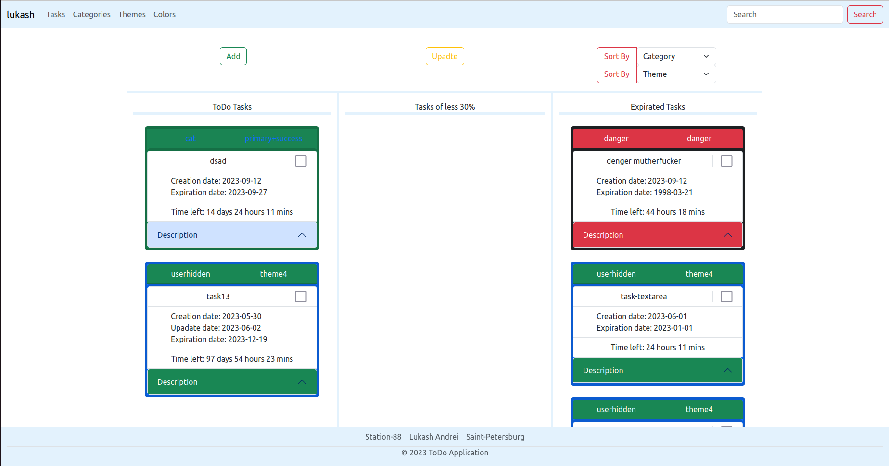

<h1>TODO</h1>

<h4> Application description</h4>
This is a ToDo project which's based on kanban lean method. All tasks are divided into three columns: ToDo tasks(new tasks), Tasks of less 30%(tasks that's time left less then 30%), Expirated tasks (done or expirated tasks). If a task became done or expirated a massege about it sends to an user email.

<ui><h4>The functionality of the project includes:</h4></ui>
<li>fastapi_users authentication system that is based on cookies transport and redis strategy; </li>

<li>Possibility to add new task, theme or category;</li>
<li>Possibility to choose color for any tasks;</li>
<li>Possibility to change task, theme or category;</li>
<li>Possibility to sort tasks by category or theme</li>
<li>Possibility to search tasks by its name;</li>

<ui><h4>Basic frameworks and libraries:</h4></ui>
<li>FastAPI
<li>alembic
<li>SQLalchemy
<li>bootstrap
<li>celery
<li>fastapi_users
<li>asyncpg
<li>redis-server

<h4>Screen of application</h4>



<h4> Steps to activate the project on linux machine</h4>
<p>1. Clone git repository to your machine:</p>

```
git clone git@github.com:lukash-ST88/TODO.git
```

<p>2. Create and activate vertual enviroment:</p>

```
python -m venv [name]

source [name]/bin/activate
```

<p>3. Install all requirements: </p>

```
pip install -r requirements.txt 
```

<p> 4. Create .env file and fill it with your own database and backend data: </p>

```
DB_HOST=localhost
DB_PORT=5432
DB_NAME=name
DB_USER=user
DB_PASS=password

SECRET_TOKEN=secret_token

SMTP_USER=some_email@gmail.com
SMTP_PASSWORD=some_email_password
```

<p>5. Install [redis-server](https://www.digitalocean.com/community/tutorials/how-to-install-and-secure-redis-on-ubuntu-20-04) on linux machine and start it then:</p>

```
sudo service redis-server start
```

<p> 6. Migrate data to the database</p>

```
alembic revision --autogenerate -m "message"
alembic upgrade head
```

<p> 7. Run the application </p>

```
uvicorn todo_app.main:app --reload
```

